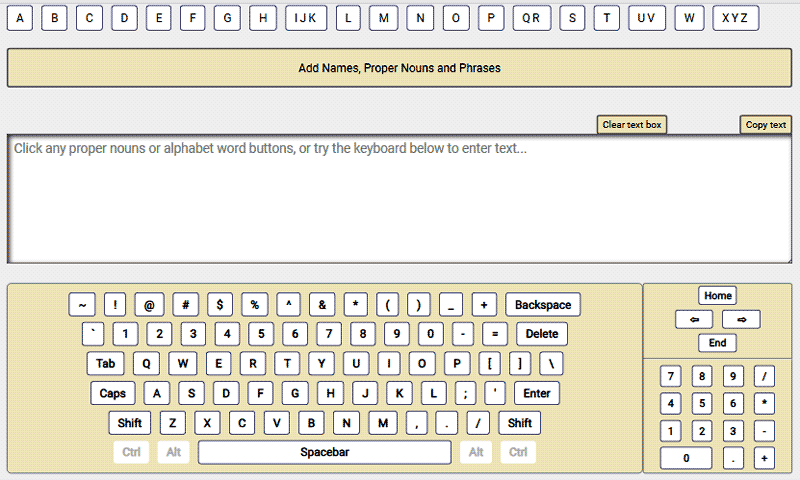

# Virtual Keyboard Assistant



A TypeScipt project to make a virtual keyboard to assist people with reduced fine motor skills. The hope is that composing letters and emails would be easier with this tool for an individual with an assitive mouse.

The final textarea output would have to be copied with the copy button above the textarea, and then pasted from the clipboard into a document or email program. View the [live demo on Netlify](https://cool-travesseiro-9b6101.netlify.app/).

## Setup

The only dependency is TypeScript:

```sh
# Initiate a Node.js project (creates package.json):
npm init -y
# Install Typescript as a dev dependency:
npm install typescript --save-dev
# Initialize TypeScript (creates tsconfig.json):
npx tsc --init
# Create dist and src folders:
mkdir dist src
# create main .ts file:
touch src/index.ts
# Create HTML file for deploy in dist folder:
touch dist/index.html
# Build and watch your files:
npx tsc -w
# Or just build your files:
npx tsc
```

Double check the values in `tsconfig.json` such as `outDir` which is set to `./dist`. Normally, you would not push your `dist` folder but I had to for the deploy yo Netlify.

## To-Do items

### File Upload option

At this point I have hard-coded values for the alphabetical words and proper nouns sections. That data is in `content.ts`. I did a lot of research to add common words and phrases for US English. It would be better to have a file upload option so that users could upload either:

1. Their own list of alphabetical words and proper nouns for their language and/or region, or
2. Have a user upload a large sample of their writing and populate the alphabetical and proper noun sections based on t he sample.

For #2, there would have to be some array methods after spliting the text for. You would want to `reduce` the words to get the count each word appeared in the sample, `sort` descending by the word count for each word, and finally `filter` by character count and frequency. And that is just for the alphabetical option. The proper nouns section could be loaded into the DOM as they appear in the file.

You would also need a checkbox to have the user specify whether they have the final alpha words, or need them reduced, sorted, and filtered. You will need some number input fields to increase or decrease the character count and/or the word frequency if the first run yielded too few or too many words.

That's a lot of extra work, and since no one has used or downloaded my app, I'm not interested at this time to add those features.

### Errors and bugs

In total I am happy with the app. Here are the only issues I have right now (4-29-2023):

1. I have notes in my code for a few errors I had with TypeScript. I found work-arounds, but I don't like fixes like that. This is my first TS project so I'll figure it out.
2. If the active line in the textarea is out of view, entering a character from the keyboard makes the page jump to the top of the page. That needs to be fixed.
   1. Maybe check to see if cursor position is out of view with `getBoundingClientRect` then scroll to it.
   2. Or limit the page size by moving the _Notes_ section to its own page.

### Language and keyboard options.

I would like to have a select list for the end user to be able to choose the language and keyboard layout that they want. I was not able to find an API for the various keyboard layouts and doing it manually for all languages and keyboards is more than I want to do at this time.

## Contributions

> Coming soon

## Code of Conduct

> Coming soon

## License

> Coming soon
